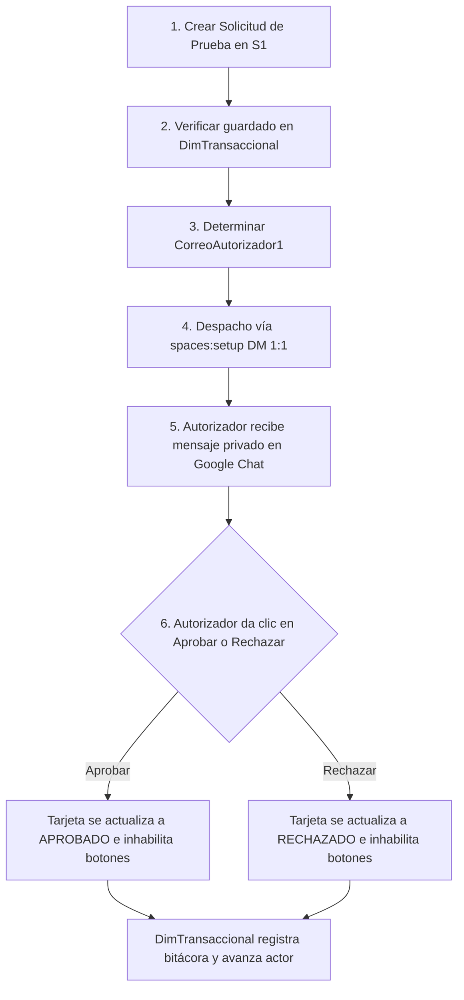

# Guía Integral de Configuración: Google Chat App para Autorizaciones 1:1

Esta guía técnica detalla, paso a paso y con máxima precisión, el procedimiento para configurar, desplegar y autorizar la **Google Chat App del Portal de Viáticos** en el entorno corporativo de **Google Workspace (Banco Integral)**.

El objetivo de esta arquitectura es garantizar que:
1. Las solicitudes de autorización se envíen **únicamente por Mensaje Directo (DM 1:1)** al correo del autorizador en turno, garantizando privacidad absoluta frente a canales o salas grupales.
2. La tarjeta interactiva no contenga información sensible bancaria.
3. Los botones de acción (**Aprobar** y **Rechazar**) funcionen de forma nativa e interactiva, bloqueando la tarjeta una vez procesada.

---

## Índice de Contenidos

1. [Diferencia Clave: Webhook vs. Google Chat App](#1-diferencia-clave-webhook-vs-google-chat-app)
2. [Paso 1: Configurar Proyecto Estándar en Google Cloud Platform (GCP)](#paso-1-configurar-proyecto-estándar-en-google-cloud-platform-gcp)
3. [Paso 2: Habilitar y Configurar la Google Chat API](#paso-2-habilitar-y-configurar-la-google-chat-api)
4. [Paso 3: Configurar Google Apps Script y Manifiesto (`appsscript.json`)](#paso-3-configurar-google-apps-script-y-manifiesto-appsscriptjson)
5. [Paso 4: Mecanismo de Despacho 1:1 a un Único Destinatario](#paso-4-mecanismo-de-despacho-11-a-un-único-destinatario)
6. [Paso 5: Gestión de Permisos y Políticas en Google Workspace Admin Console](#paso-5-gestión-de-permisos-y-políticas-en-google-workspace-admin-console)
7. [Paso 6: Protocolo de Pruebas y Verificación de Flujo](#paso-6-protocolo-de-pruebas-y-verificación-de-flujo)
8. [Guía de Resolución de Problemas Frecuentes (Troubleshooting)](#guía-de-resolución-de-problemas-frecuentes-troubleshooting)

---

## 1. Diferencia Clave: Webhook vs. Google Chat App

| Característica | Webhook Entrante (Incoming Webhook) | Google Chat App (Nativo) |
| :--- | :--- | :--- |
| **Destinatario** | Exclusivamente a un **Espacio / Canal compartido**. No puede enviar mensajes privados a personas específicas. | **Mensaje Directo 1:1 privado** al correo corporativo de la persona. |
| **Interactividad** | **No soporta acciones interactivas**. Al dar clic en un botón muestra error: *"Webhook Bot no puede procesar tu solicitud"*. | **100% Interactivo**. Procesa eventos `onCardClick` en Apps Script y actualiza la tarjeta en vivo. |
| **Privacidad** | Pública para todos los miembros del espacio de chat. | Privada entre el Bot del Portal de Viáticos y el autorizador. |
| **Gestión de Estado** | No puede bloquear ni modificar la tarjeta luego de enviada. | Bloquea la tarjeta inmediatamente (`UPDATE_MESSAGE`) tras votar. |

---

## 2. Paso 1: Configurar Proyecto Estándar en Google Cloud Platform (GCP)

Para que Google Apps Script pueda interactuar con la API de Google Chat y registrar eventos de clic, el script debe estar vinculado a un **Proyecto Estándar de Google Cloud** (no al proyecto predeterminado por defecto de Apps Script).

### 1.1 Crear o Seleccionar un Proyecto en GCP
1. Inicia sesión con tu cuenta corporativa de Banco Integral en la [Consola de Google Cloud](https://console.cloud.google.com/).
2. En la barra superior, haz clic en el selector de proyectos y pulsa **"Nuevo Proyecto"**.
3. Asigna un nombre claro, por ejemplo: `viaticos-banco-integral-prod`.
4. Selecciona la Organización de tu dominio de Google Workspace y haz clic en **"Crear"**.
5. Copia el **Número de Proyecto** (Project Number) que aparece en la pantalla principal del panel del proyecto.

### 1.2 Configurar la Pantalla de Consentimiento de OAuth
1. En el menú lateral de GCP, ve a **APIs y Servicios** > **Pantalla de consentimiento de OAuth**.
2. Selecciona tipo de usuario: **"Interno"** (Internal), asegurando que solo usuarios del dominio de Banco Integral puedan acceder.
3. Completa los campos básicos:
   - **Nombre de la aplicación**: `Portal de Viáticos - Banco Integral`
   - **Correo de asistencia al usuario**: Tu correo corporativo o el del equipo de TI.
   - **Datos de contacto del desarrollador**: Tu correo corporativo.
4. En la sección **Permisos (Scopes)**, agrega los siguientes alcances:
   - `https://www.googleapis.com/auth/chat.spaces.create` (Crear espacios de chat 1:1)
   - `https://www.googleapis.com/auth/chat.messages.create` (Enviar tarjetas y mensajes)
   - `https://www.googleapis.com/auth/chat.bot` (Funciones de bot)
   - `https://www.googleapis.com/auth/spreadsheets` (Acceso a bases de datos)
   - `https://www.googleapis.com/auth/drive` (Gestión de comprobantes en Drive)
   - `https://www.googleapis.com/auth/script.external_request` (Llamadas HTTP a la API)
5. Guarda y finaliza la configuración.

### 1.3 Vincular el Proyecto GCP a Google Apps Script
1. Abre tu proyecto de Google Apps Script donde está el código de Viáticos.
2. En el menú lateral izquierdo, haz clic en el icono de engranaje **Configuración del proyecto** (Project Settings).
3. Desplázate hasta la sección **Proyecto de Google Cloud Platform (GCP)**.
4. Haz clic en **"Cambiar proyecto"** e ingresa el **Número de Proyecto** de GCP copiado en el paso 1.1.
5. Haz clic en **"Establecer proyecto"**.

---

## 3. Paso 2: Habilitar y Configurar la Google Chat API

### 3.1 Habilitar la API
1. En la consola de GCP, ve a **APIs y Servicios** > **Biblioteca**.
2. Busca `Google Chat API` y entra en el resultado.
3. Haz clic en el botón azul **"Habilitar"**.

### 3.2 Configurar la Aplicación de Chat (Chat App)
Una vez habilitada la API, ve a **APIs y Servicios** > **Google Chat API** y haz clic en la pestaña **"Configuración"** (Configuration):

1. **Información de la Aplicación**:
   - **Nombre de la app**: `Portal de Viáticos`
   - **URL del avatar**: Ingresa una URL de imagen oficial o usa el logotipo de Banco Integral:
     `https://lh3.googleusercontent.com/aida-public/AB6AXuD0xJD1t15SJ-OElz4OulRz6eM7b-gNXdb3XH_fL8hayrSjkCuvGKMZ3WhBmBkUc_T51ARwFZvdK1-Wha25vWGbC28w5nk57WAwOP0xPywpFVRpyrY4fSxJiwWdwuXycGGTyusw07bKeeXOngUsO5rktajW1N9qYbkRbQXR2ZJHuCNJAN0QQNidIY-MSX0DBvN7UX2xvHXfvFqQysDSdbNhLRB_P2gxPDCjymXEooY2tF7PPqvqeVOBwvE5MNU_DYoeayU`
   - **Descripción**: `Bot corporativo para la notificación y resolución interactiva de autorizaciones de viáticos.`

2. **Funcionalidades Interactivas (Interactive Features)**:
   - Marca la casilla **"Habilitar funciones interactivas"** (Enable interactive features).

3. **Funcionalidad (Functionality)**:
   - Marca la casilla **"Recibir mensajes 1:1"** (Receive 1:1 messages).
   - *(Opcional)*: Puedes desmarcar "Unirse a espacios y conversaciones grupales" si deseas que opere estrictamente por mensaje directo privado.

4. **Configuración de Conexión (Connection Settings)**:
   - Selecciona **"Apps Script"**.
   - En el campo **ID de despliegue (Deployment ID)**, introduce el ID del despliegue creado en Apps Script (Ver sección 4.2).

5. **Visibilidad (Visibility)**:
   - Selecciona **"Disponible para personas y grupos específicos en tu organización"** (para pruebas iniciales) o **"Disponible para todos en tu organización"** (para producción).

6. Haz clic en **"Guardar"**.

---

## 4. Paso 3: Configurar Google Apps Script y Manifiesto (`appsscript.json`)

### 4.1 Configurar el archivo `appsscript.json`
En el editor de Google Apps Script:
1. Ve a **Configuración del proyecto** y activa la opción **"Mostrar el archivo de manifiesto 'appsscript.json' en el editor"**.
2. En el archivo `appsscript.json`, asegúrate de incluir la clave `"chat": {}` y los alcances requeridos:

```json
{
  "timeZone": "America/El_Salvador",
  "dependencies": {},
  "exceptionLogging": "STACKDRIVER",
  "runtimeVersion": "V8",
  "chat": {},
  "oauthScopes": [
    "https://www.googleapis.com/auth/chat.spaces.create",
    "https://www.googleapis.com/auth/chat.messages.create",
    "https://www.googleapis.com/auth/chat.bot",
    "https://www.googleapis.com/auth/script.external_request",
    "https://www.googleapis.com/auth/spreadsheets",
    "https://www.googleapis.com/auth/drive",
    "https://www.googleapis.com/auth/userinfo.email"
  ]
}
```

### 4.2 Crear el Despliegue de Versión para Google Chat
1. En la parte superior derecha del editor de Apps Script, haz clic en **Implementar** (Deploy) > **Nueva implementación** (New deployment).
2. Haz clic en el icono de engranaje a la izquierda de "Seleccionar tipo" y elige **"Complemento de Google Workspace"** o **"Aplicación de Google Chat"**.
3. Escribe una descripción (ej. `Versión 1.0 - Despacho DM 1:1`).
4. Haz clic en **"Implementar"**.
5. **Copia el "ID de implementación" (Deployment ID)** generado y pégalo en la configuración de la Google Chat API en GCP (Paso 3.2 punto 4).

---

## 5. Paso 4: Mecanismo de Despacho 1:1 a un Único Destinatario

Para garantizar que la tarjeta se envíe **única y exclusivamente** al buzón personal del autorizador en turno, el backend implementa el siguiente flujo mediante la API de Google Chat:

### 5.1 Flujo de Creación de Espacio DM Privado
El backend utiliza el endpoint oficial `spaces:setup` pasando el token de sesión OAuth (`ScriptApp.getOAuthToken()`):

```javascript
// 1. Crear / obtener el espacio de Mensaje Directo con el correo del autorizador
var urlSetup = "https://chat.googleapis.com/v1/spaces:setup";
var setupBody = {
  space: {
    spaceType: "DIRECT_MESSAGE",
    singleUserBotDm: true
  },
  memberships: [
    {
      member: {
        name: "users/" + encodeURIComponent(correoAutorizador),
        type: "HUMAN"
      }
    }
  ]
};

var resSetup = UrlFetchApp.fetch(urlSetup, {
  method: "post",
  contentType: "application/json; charset=UTF-8",
  headers: { "Authorization": "Bearer " + oauthToken },
  payload: JSON.stringify(setupBody),
  muteHttpExceptions: true
});
```

### 5.2 Despacho del Mensaje con Tarjeta Cards v2
Una vez obtenido el identificador del espacio privado (`resSetup.name`, ej. `spaces/AAAAAAAA`), se publica la tarjeta Cards v2 en esa conversación privada:

```javascript
var spaceName = JSON.parse(resSetup.getContentText()).name;
var urlMensaje = "https://chat.googleapis.com/v1/" + spaceName + "/messages";

UrlFetchApp.fetch(urlMensaje, {
  method: "post",
  contentType: "application/json; charset=UTF-8",
  headers: { "Authorization": "Bearer " + oauthToken },
  payload: JSON.stringify(payloadCard),
  muteHttpExceptions: true
});
```

### 5.3 Procesamiento Interactivo (`onCardClick`) y Bloqueo de Estado
Cuando el autorizador hace clic en **Aprobar** o **Rechazar**:
1. Google Chat invoca automáticamente la función `onCardClick(event)` en `Código.gs.txt`.
2. El sistema actualiza el registro en `DimTransaccional` (restando pendientes, registrando bitácora y avanzando al siguiente nivel autorizante si aplica).
3. Devuelve un objeto con `actionResponse: { type: "UPDATE_MESSAGE" }` que sustituye los botones por el estado final del expediente, previniendo dobles resoluciones.

---

## 6. Paso 5: Gestión de Permisos y Políticas en Google Workspace Admin Console

Para permitir que los usuarios de Banco Integral reciban mensajes y puedan interactuar con la aplicación sin bloqueos de seguridad del dominio:

1. Ingresa a la [Consola de Administración de Google Workspace](https://admin.google.com/) con credenciales de Administrador.
2. Dirígete a **Menú** > **Aplicaciones** > **Google Workspace** > **Google Chat**.
3. En la sección **Chat y Spaces**:
   - Asegúrate de que el servicio de Chat esté en estado **"Activado para todos"** (o para las unidades organizativas de los colaboradores y directivos).
4. Ve a la sección **Gestionar aplicaciones de Chat**:
   - Haz clic en **"Permitir que los usuarios instalen aplicaciones de Chat"**.
   - En la opción de instalación de aplicaciones internas, selecciona **"Permitir que los usuarios agreguen cualquier aplicación de Chat desarrollada en el dominio"**.
5. *(Opcional - Instalación Forzada por Administrador)*:
   - Si deseas que el bot aparezca automáticamente instalado en el Google Chat de todos los autorizadores sin que ellos tengan que buscarlo manualmente, ve a **Google Workspace Marketplace** > **Aplicaciones de instalación forzada** y añade el ID de la app desarrollada.

---

## 7. Paso 6: Protocolo de Pruebas y Verificación de Flujo

Para validar que todo el sistema opera correctamente, ejecuta el siguiente protocolo:



### Checklist de Validación de Seguridad y Privacidad

- [ ] **Buzón Privado**: La tarjeta aparece como un chat individual con el bot `Portal de Viáticos` en el cliente de Google Chat del autorizador, y **no** en ningún espacio o grupo.
- [ ] **Sin Datos Bancarios**: La tarjeta muestra Solicitante, Gerencia, Monto, Tipo de Viático, Fechas y Motivo, **sin** incluir Banco, Tipo de Cuenta ni Número de Cuenta.
- [ ] **Monto Correcto**: El monto en la tarjeta coincide exactamente con el valor solicitado (ej. `$12.00`).
- [ ] **Badge de Presupuesto**: Muestra claramente `✓ Dentro de Presupuesto` o `⚠ Fuera de Presupuesto`.
- [ ] **Bloqueo Inmediato**: Al presionar cualquier botón de resolución, los botones desaparecen y el mensaje muestra el sello de resolución con fecha, hora y responsable.
- [ ] **Trazabilidad en Base de Datos**: En la hoja `DimTransaccional`, las columnas `EstadoSolicitud`, `AutorizacionesPendientes`, `ActorActual` y `DatosAutorizacion` se actualizan de forma instantánea.

---

## 8. Guía de Resolución de Problemas Frecuentes (Troubleshooting)

### Problema 1: `API de Google Chat no habilitada (403 Forbidden)`
- **Causa**: La API de Google Chat no está habilitada en el proyecto GCP vinculado a Apps Script.
- **Solución**: Revisa el [Paso 2.1](#31-habilitar-la-api) y confirma que el Número de Proyecto en Apps Script coincida con el proyecto de GCP donde se activó la API.

### Problema 2: `"Webhook Bot no puede procesar tu solicitud"`
- **Causa**: La tarjeta fue enviada a través de un Incoming Webhook tradicional en lugar de la API de Google Chat con Google Apps Script.
- **Solución**: Asegúrate de haber completado el [Paso 3.2](#32-configurar-la-aplicación-de-chat-chat-app) conectando la Chat App con el `Deployment ID` del Apps Script.

### Problema 3: Error al crear espacio DM: `users/email not found`
- **Causa**: El correo del autorizador tiene errores tipográficos o pertenece a un dominio externo no federado en Google Workspace.
- **Solución**: Verifica que el correo registrado en `DimGerencias` o `DimRegiones` sea el correo institucional activo exacto del colaborador.

### Problema 4: La tarjeta no se actualiza al dar clic en Aprobar/Rechazar
- **Causa**: El manifest `appsscript.json` no tiene la clave `"chat": {}` o la función `onCardClick` no está definida a nivel global en `Código.gs.txt`.
- **Solución**: Verifica que `onCardClick(event)` exista en el código Apps Script y que devuelva el payload con `actionResponse: { type: "UPDATE_MESSAGE" }`.
