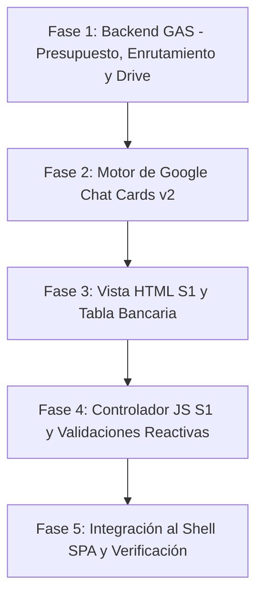

# Plan de Implementación: Página S1 (Nueva Solicitud), Motor Presupuestario y Tarjetas Google Chat

Construir e integrar el módulo **S1 (Nueva Solicitud de Viáticos)** dentro de la arquitectura modular de Google Apps Script (GAS), respetando estrictamente las especificaciones de [`Documentacion/Fuente de Verdad.md`](file:///d:/Roberto/Documents/Antigravity%20D/Viaticos/V3_MVP/Documentacion/Fuente%20de%20Verdad.md), el diseño UI de [`Diseño UI/Solicitantes/S1 Nueva Solicitud.html`](file:///d:/Roberto/Documents/Antigravity%20D/Viaticos/V3_MVP/Dise%C3%B1o%20UI/Solicitantes/S1%20Nueva%20Solicitud.html) y [`Diseño UI/Editores/E1.1 Provision de pago.html`](file:///d:/Roberto/Documents/Antigravity%20D/Viaticos/V3_MVP/Dise%C3%B1o%20UI/Editores/E1.1%20Provision%20de%20pago.html), e incorporando el sistema interactivo de **Tarjetas de Google Chat (Cards v2)** para la aprobación y rechazo de solicitudes.

---

## Decisiones de Arquitectura y Reglas de Negocio

1. **Frontend Modular S1**:
   * `View_NuevaSolicitud.html`: Maquetación dividida en Sección 1 (Datos del Solicitante de solo lectura) y Sección 2 (Detalle del Viático con componentes reactivos).
   * `JS_NuevaSolicitud.html`: Controlador de interfaz para autocompletado, semáforo visual de contornos (`border-red`, `border-green`, `hover:border-celeste`), validación condicional de fechas/duración, tabla de detalle bancario con pop-up centralizado de advertencia de edición, carga de archivos a Drive y envío.
2. **Componente de Detalle Bancario (Modo Tabla)**:
   * Replicará el diseño tabular de [`E1.1 Provision de pago.html`](file:///d:/Roberto/Documents/Antigravity%20D/Viaticos/V3_MVP/Dise%C3%B1o%20UI/Editores/E1.1%20Provision%20de%20pago.html) (`Banco`, `Tipo de cuenta`, `No. de cuenta`) con botón **"Editar"**.
   * Modal centrado de confirmación de riesgo ("Proseguir" / "Cancelar") que activa `EsEditado = "Si"` y muestra botón "Regresar" para revertir y bloquear.
3. **Motor Presupuestario en Google Sheets (`Presupuesto_Viaticos2.0`)**:
   * Búsqueda por coordenada `CC-RC` (Centro de Costo - Rubro Contable) y Columna = Mes de creación.
   * Si `Disponible >= Monto`: descuenta de `DimDisponible`, suma a `DimConsumo` y marca `DentroPresupuesto = "Si"`.
   * Si `Disponible < Monto`: no afecta saldos y marca `DentroPresupuesto = "No"`.
4. **Motor de Enrutamiento Autorizante (Matriz de 16 Casos)**:
   * Determina la ruta según Presupuesto (`Si`/`No`), Ubicación (`Back-Office`/`Agencias`) y Plaza (`Caso 1`, `Caso 2`, `Caso 3`, `Caso 4`).
   * Asigna los correos de `CorreoJefeRegional` (Nivel 0), `CorreoAutorizador1`, `CorreoAutorizador2`, `CorreoAutorizador3`.
   * Establece `AutorizacionesPendientes` y `ActorActual`.
   * Caso 4 (Director Ejecutivo): pasa directamente a `EstadoSolicitud = "AUTORIZADO"` con 0 autorizaciones pendientes.
5. **Almacenamiento de Archivos Adjuntos en Google Drive**:
   * Carpeta raíz: `03 - ArchivosAdjuntos_Viaticos2.0` (ID: `13UoxfM1c0kzrB8yh7JjhlfbeFEjVlKj6`).
   * Creación automática de subcarpeta `Archivos - [ID_Solicitud]` y almacenamiento de URLs en JSON dentro de `DimTransaccional.ArchivosAdjuntos`.
6. **Sistema Interactivo de Tarjetas Google Chat (Cards v2)**:
   * Generación y envío del payload interactivo (Card v2) al primer autorizante (`ActorActual`).
   * Manejo de acciones interactivas (`APROBAR` / `RECHAZAR`) con campo de comentarios.
   * **Bloqueo y actualización in-place de la tarjeta**: al recibir una resolución, la tarjeta se actualiza en el chat (`updateCard` / `UPDATE_MESSAGE`) cambiando su estado a "Procesada - Aprobada/Rechazada" y deshabilitando los botones de acción para prevenir votos duplicados o contradictorios (resolviendo el punto P.D. del documento).

---

## Lista de Tareas y Fases

### Fase 1: Backend GAS - Persistencia, Presupuesto, Enrutamiento y Drive

#### [MODIFY] [Código.gs.txt](file:///d:/Roberto/Documents/Antigravity%20D/Viaticos/V3_MVP/Codigo%20producido/C%C3%B3digo.gs.txt)
- Implementar `obtenerUsuariosPorCentroCosto(centroCosto)` para solicitudes de tipo "Delegado".
- Implementar `guardarArchivosEnDrive(idSolicitud, archivosBase64)` creando subcarpeta en la carpeta oficial `13UoxfM1c0kzrB8yh7JjhlfbeFEjVlKj6`.
- Implementar `validarYAfectarPresupuesto(centroCostoNum, rubroCodigo, mesIndex, monto)` sobre `Presupuesto_Viaticos2.0` (`DimDisponible`, `DimConsumo`).
- Implementar `calcularRutaAutorizante(datosSolicitante, monto, dentroPresupuesto)` resolviendo los 16 casos de back-office y agencias a partir de `DimGerencias` y `DimRegiones`.
- Implementar `guardarNuevaSolicitudS1(datosEmpaquetados)` que orquesta la generación de correlativo `SOL-YYYY-XXXX`, validación presupuestaria, enrutamiento, guardado en `DimTransaccional` y disparo de la tarjeta de Google Chat.

---

### Fase 2: Motor de Tarjetas Interactivas de Google Chat (Cards v2)

#### [MODIFY] [Código.gs.txt](file:///d:/Roberto/Documents/Antigravity%20D/Viaticos/V3_MVP/Codigo%20producido/C%C3%B3digo.gs.txt)
- Diseñar la estructura JSON de la Card v2 para Google Chat:
  - Header institucional: "Solicitud de Viático [ID_Solicitud]".
  - Secciones: Datos del Solicitante, Fechas, Tipo de Viático, Justificación, Detalle Bancario y Badge de Monto Total.
  - Widgets interactivos: Área de texto para "Comentarios del Autorizador" y botones de acción ("Aprobar" en verde, "Rechazar" en rojo).
- Implementar función `enviarTarjetaGoogleChat(correoAutorizador, idSolicitud, datosCard)`.
- Implementar función `procesarResolucionGoogleChat(idSolicitud, nivel, autorizador, resolucion, comentario)` que:
  - Registra el evento en `DatosAutorizacion` (JSON).
  - Si es Rechazo $\rightarrow$ `EstadoSolicitud = "RECHAZADO POR AUTORIZADOR"`.
  - Si es Aprobación $\rightarrow$ decrementa `AutorizacionesPendientes`. Si llega a 0 $\rightarrow$ `EstadoSolicitud = "AUTORIZADO"`; si no, envía la tarjeta al siguiente nivel.
  - Retorna el payload de actualización para bloquear la tarjeta en Google Chat y evitar doble votación.

---

### Fase 3: Maquetación HTML de S1 (Nueva Solicitud)

#### [NEW] [View_NuevaSolicitud.html](file:///d:/Roberto/Documents/Antigravity%20D/Viaticos/V3_MVP/Codigo%20producido/View_NuevaSolicitud.html)
- **Sección 1 (Solo Lectura)**: Tarjeta `#E2E8F0` con campos bloqueados: Nombre, Correo, Cargo, Gerencia, Centro de Costo, Agencia.
- **Sección 2 (Detalle del Viático)**:
  - Selector de Duración de la actividad: "Día único" / "Rango de días".
  - Fechas de Inicio y Fin con validación de bloqueo condicional.
  - Catálogo de Categorías de viáticos (incluyendo validación de `EsMovil` para Operativos Móviles).
  - Selector de Hora del Evento (condicionado exclusivamente a "Reunión fuera de horario").
  - Selector de Tipo de Solicitud ("Personal" / "Delegado") con dropdown dinámico de destinatarios del mismo centro de costo.
  - **Componente Tabla "Detalle bancario"**:
    - Tabla con Banco, Tipo de cuenta, No. de cuenta y Monto ($).
    - Botón "Editar" con lápiz, icono "Regresar" de reversión y **Modal Pop-up Centrado** de advertencia y confirmación de responsabilidad.
  - Área de texto para "Motivo del viático".
  - Zona Drag & Drop de archivos adjuntos con galería interactiva y chip de eliminación.
- **Botones de Acción**: "Limpiar Campos" (outline navy) y "Guardar Solicitud" (solid orange).
- **Modales Centralizados**: Pop-ups mejorados y centrados en pantalla para éxito, errores y confirmación.

---

### Fase 4: Controlador JavaScript de S1 y Validaciones

#### [NEW] [JS_NuevaSolicitud.html](file:///d:/Roberto/Documents/Antigravity%20D/Viaticos/V3_MVP/Codigo%20producido/JS_NuevaSolicitud.html)
- Función `precargarDatos_Form_NuevaSolicitud()` para poblar datos de sesión.
- Validaciones visuales reactivas (Rojo si falta obligatorio, Celeste en hover/focus, Verde al completar).
- Manejo de eventos de cambio en Duración de actividad, Tipo de viático, Hora del evento y Tipo de solicitud.
- Lógica de edición de datos bancarios: apertura de modal, desbloqueo de inputs, botón de reversión y activación de bandera `EsEditado`.
- Lógica de arrastrar y soltar archivos, preview en galería y validación de obligatoriedad si `FechaSolicitud - FechaInicio <= 2 días`.
- Empaquetado y envío de datos a `guardarNuevaSolicitudS1` con feedback de carga y feedback modal centrado.

---

### Fase 5: Integración en Shell SPA y Verificación

#### [MODIFY] [Index.html](file:///d:/Roberto/Documents/Antigravity%20D/Viaticos/V3_MVP/Codigo%20producido/Index.html)
- Agregar inclusiones `<?!= include('View_NuevaSolicitud'); ?>` y `<?!= include('JS_NuevaSolicitud'); ?>`.

#### [MODIFY] [View_Home.html](file:///d:/Roberto/Documents/Antigravity%20D/Viaticos/V3_MVP/Codigo%20producido/View_Home.html)
- Enlazar la opción "Nueva Solicitud" del menú lateral a la función de navegación `navegarSubmenu('view-nueva-solicitud')`.
- Insertar el contenedor de vista `
...
` en el área de trabajo.

#### [MODIFY] [JS_Logic.html](file:///d:/Roberto/Documents/Antigravity%20D/Viaticos/V3_MVP/Codigo%20producido/JS_Logic.html)
- Agregar llamadas de inicialización de S1 en `navegarSubmenu('view-nueva-solicitud')`.

#### [NEW] [preview_local.html](file:///d:/Roberto/Documents/Antigravity%20D/Viaticos/V3_MVP/Codigo%20producido/preview_local.html)
- Recompilar el preview local unificado para pruebas inmediatas en navegador.

---

## Plan de Verificación

### 1. Pruebas de Interfaz y Comportamiento UI (S1)
- Validar que al ingresar con un perfil `EsMovil == "No"`, la opción de "Viático Movilidad" esté bloqueada o no aparezca.
- Seleccionar "Día único" y comprobar que "Fecha Fin" quede bloqueada; seleccionar "Rango de días" y comprobar que se desbloquee.
- Probar que no se permita ingresar una "Fecha Fin" anterior o igual a la "Fecha Inicio".
- Seleccionar "Reunión fuera de horario" y verificar que se habilite "Hora del evento"; seleccionar cualquier otra categoría y comprobar que se bloquee.
- Seleccionar "Personal" y verificar que el destinatario y sus cuentas se autocompleten; seleccionar "Delegado" y verificar que se despliegue la lista de colaboradores del mismo centro de costo.
- Probar el botón "Editar" en Detalle Bancario: verificar que aparezca el pop-up centrado en pantalla, que al confirmar se vuelvan editables los 3 campos, que aparezca el botón "Regresar" y que al pulsarlo se restablezcan los valores originales.
- Probar la subida de archivos (PDF/JPG) y la validación de obligatoriedad si la fecha de inicio es en 2 días o menos.

### 2. Pruebas de Lógica de Negocio y Backend
- Simular una solicitud con monto menor al disponible en `Presupuesto_Viaticos2.0`: comprobar que se descuente de `DimDisponible`, se sume a `DimConsumo` y quede `DentroPresupuesto = "Si"`.
- Simular una solicitud con monto mayor al disponible: comprobar que `DentroPresupuesto = "No"` y los saldos no se alteren.
- Validar las 16 rutas autorizantes (Back-Office y Agencias) según los rangos de $x_1 = \$50$ y $x_2 = \$200$.
- Comprobar que en solicitudes del Director Ejecutivo el estado pase automáticamente a `AUTORIZADO`.
- Verificar la estructura del payload JSON de la tarjeta interactiva de Google Chat y el mecanismo de bloqueo in-place tras emitir voto.
