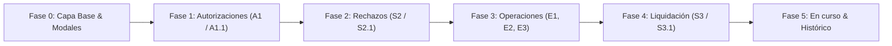

Para abordar la implementación de los cambios de forma sólida, ordenada y sin retrabajos, el **punto de partida estratégico** debe seguir el orden natural de las dependencias arquitectónicas y el ciclo de vida del flujo operativo.

A continuación, presento la **Ruta de Implementación por Fases (Roadmap)**:

---

### Punto de Partida: Fase 0 — Cimientos Transversales y Capa Base
Antes de intervenir pantallas individuales, debemos asegurar las utilidades compartidas de las que dependen todos los módulos:
1. **Capa UI/UX Transversal**:
   * Estandarización del componente de **Modales Corporativos y Toasts** (para erradicar definitivamente los `alert()` y pop-ups nativos del navegador en toda la app).
   * Helper unificado de **formato de fechas `DD/MM/YYYY`** y montos monetarios.
   * Componente homogéneo de **carga de archivos adjuntos (*append* a Google Drive / JSON)**.
2. **Capa Backend (`Código.gs`)**:
   * Función de **Devolución Presupuestaria** por reintegro en cierre (`DimDisponible` y `DimConsumo`).
   * Manejo robusto de excepciones para que ningún endpoint devuelva errores sin capturar al frontend.

---

### Ruta de Planes de Features por Fases Consecutivas:

---

#### Fase 1: Módulo de Autorizaciones (`A1` y `A1.1`)
* **Justificación**: Es el paso inmediato que sigue a la creación de una solicitud (`S1`). Actualmente en `A1.1` existe el error crítico *"No se pudo obtener el detalle"*, faltan campos bancarios en lectura y se usan pop-ups nativos.
* **Alcance**:
  * **A1**: Formato de fechas `DD/MM/YYYY`, columna `SOLICITANTE` mostrando solo el nombre, botón `[ Ver detalles ]`.
  * **A1.1**: Corrección de extracción de datos de `DimTransaccional`, renderizado completo de *Información del Solicitante* y *Detalle del Viático* (incluyendo detalle bancario y archivos), acciones de autorización y confirmación con modal corporativo.

---

#### Fase 2: Módulo de Solicitudes Rechazadas (`S2` y `S2.1`)
* **Justificación**: Permite desbloquear el flujo cuando una solicitud es rechazada por presupuesto (`RECHAZO-PRESUPUESTO`), por Compras (`RECHAZO-PROVISION 1/2`), por Tesorería (`RECHAZO-PAGO 1`) o por Cierre (`RECHAZO-CIERRE`).
* **Alcance**:
  * **S2**: Tabla adaptada a la estética de E1 (fechas `DD/MM/YYYY`, columna `Monto`, sin columna solicitante por ser bandeja personal).
  * **S2.1**: Implementación de las 5 vistas condicionales según el estado, tablas informativas de rechazo previo, reseteo de provisión en BD (Caso D) y formulario de justificación/corrección.

---

#### Fase 3: Módulos de Operaciones Compras y Tesorería (`E1/E1.1`, `E2/E2.1`, `E3/E3.1`)
* **Justificación**: Representan la etapa contable y de pago.
* **Alcance**:
  * **E1 / E1.1**: Ubicación de botones `[ Agrupar ]` y `[ Limpiar filtros ]`, modal de asiento contable de provisión, transición dinámica de botones (`[ Responder ]` $\to$ `[ Guardar ]`).
  * **E2 / E2.1**: Modal contable de desembolso TEF, sobreescritura de campos al reevaluar desde `RECHAZO-PAGO 2`.
  * **E3 / E3.1**: Agrupación exclusiva para `Reintegro y cierre`, despliegue de los 4 campos de liquidación del solicitante y activación de devolución presupuestaria.

---

#### Fase 4: Módulo de Liquidación y Rendición de Cuentas (`S3` y `S3.1`)
* **Justificación**: Cierre del ciclo operativo por parte del solicitante para solicitudes `PAGADO`.
* **Alcance**:
  * **S3**: Ajustes visuales de tabla y filtros personales.
  * **S3.1**: Formulario de cierre (*Solo cierre* vs *Reintegro y cierre* con monto/fecha), subida de comprobantes y modal corporativo de éxito.

---

#### Fase 5: Módulos Globales de Auditoría (`Solicitudes en curso` e `Histórico`)
* **Justificación**: Monitoreo y archivo histórico inmutable. Al construirse al final, reutilizan todas las estructuras y tablas consolidadas en las fases previas.
* **Alcance**:
  * Filtro de visibilidad por rol en backend (`SOLICITANTE`/`AUTORIZADOR` ven solo lo propio; `COMPRAS`/`TESORERIA`/`ADMIN` ven todo).
  * Eliminación de columna y filtro `TIPO`, fechas en `DD/MM/YYYY`.
  * Vista de detalle integral replicando la estructura acumulativa de **S3.1** (con tablas de *Cierre Solicitante* y *Cierre Compras*).

---

### Siguiente Paso Recomendado

Iniciar con el **Plan de Feature para la Fase 0 (Capa Base y Helpers Transversales)** y continuar de inmediato con la **Fase 1 (Módulo de Autorizaciones A1 y A1.1)**. 

¿Deseas que preparemos el primer plan detallado de ejecución enfocado en la **Fase 0 y Fase 1**?