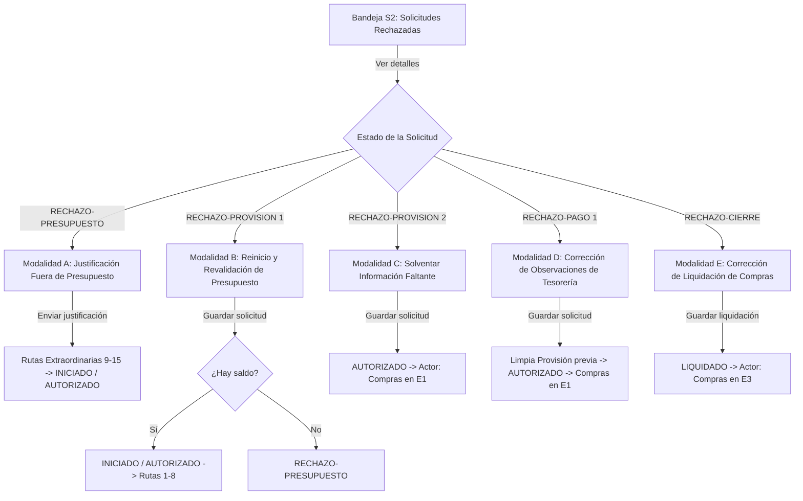

# Plan de Implementación: Módulo S2 y S2.1 (Solicitudes Rechazadas y Multi-Resolución) & Corrección de Reglas en DatosAutorizacion

## 1. Contexto y Objetivos

Este plan aborda la refactorización integral de los módulos de Solicitudes Rechazadas (**S2**) y Detalle / Resolución Multi-Rechazo (**S2.1**) para el rol de Solicitante, alineándolos al 100% con la [Fuente de Verdad - parte 2](file:///d:/Roberto/Documents/Antigravity%20D/Viaticos/V3_MVP/Documentacion/Fuente%20de%20Verdad%20-%20parte%202.md) y los estándares de diseño y arquitectura ya implementados en S1, E1/E1.1, E2/E2.1, S3/S3.1 y E3/E3.1.

Asimismo, incorpora la corrección mandatoria identificada en `DatosAutorizacion`:
1. **Exclusividad de Autorizadores**: `DatosAutorizacion` es una bitácora reservada **únicamente** para las firmas y resoluciones emitidas por los autorizadores institucionales (`APROBADO`, `RECHAZADO`). El solicitante nunca se registra como firmante (`nivel: 0`, `CREADO`, `ENVIADO` ni `JUSTIFICADO`).
2. **Reserva de Nivel 0**: El `nivel: 0` corresponde exclusivamente al rol `Jefe Regional` y solo aplica cuando el solicitante pertenece a la gerencia `AGENCIAS`.
3. **Persistencia de Justificación**: Para solicitudes en `RECHAZO-PRESUPUESTO`, la justificación del solicitante se almacena exclusivamente en la columna dedicada `JustificacionPresupuesto`.

---

## 2. Dependencias y Arquitectura

---

## 3. Desglose de Tareas Verticales

### Tarea 1: Corrección de Reglas de `DatosAutorizacion` y Backend Apps Script para S2 y S2.1 (`Código.gs.txt`)
- **Archivos a modificar**: `Codigo producido/Código.gs.txt`
- **Descripción**:
  1. Garantizar que en la creación de solicitudes (S1) `DatosAutorizacion` inicie como array vacío `[]`.
  2. Eliminar cualquier inyección de solicitante en `DatosAutorizacion` con `nivel: 0` o `CREADO` / `JUSTIFICADO`.
  3. Refactorizar `obtenerSolicitudesRechazadas(correoUsuario)` con `obtenerColMapTransaccional(headers)` para filtrar por solicitante autenticado y los 5 estados válidos (`RECHAZO-PRESUPUESTO`, `RECHAZO-PROVISION 1`, `RECHAZO-PROVISION 2`, `RECHAZO-PAGO 1`, `RECHAZO-CIERRE`).
  4. Refactorizar `obtenerDetalleSolicitudRechazada(idSolicitud)` para cargar todas las columnas transaccionales, datos de auditoría de Compras/Tesorería y archivos adjuntos.
  5. Refactorizar `resolverRechazoS2_1(idSolicitud, tipoRechazo, payload, correoUsuario)` con los 5 flujos operativos:
     - `RECHAZO-PRESUPUESTO`: Guarda en `JustificacionPresupuesto`, no toca `DatosAutorizacion`, calcula rutas 9-15 con `DentroPresupuesto = 'No'`, asigna primer autorizador o `AUTORIZADO`.
     - `RECHAZO-PROVISION 1`: Reinicia `DatosAutorizacion = []`, revalida presupuesto con nuevo monto, pasa a `INICIADO`/`AUTORIZADO` (si hay saldo) o a `RECHAZO-PRESUPUESTO` (si no hay saldo).
     - `RECHAZO-PROVISION 2`: Conserva firmas previas y saldo, anexa archivos, pasa a `AUTORIZADO` con `ActorActual = 'Compras'` y notifica a Compras.
     - `RECHAZO-PAGO 1`: Limpia columnas de provisión previa (`ResolucionProvision`, `ComentarioProvision`, `FechaProvision`, `NombreProvision`, `AgrupableProvision`), conserva firmas previas y saldo, pasa a `AUTORIZADO` con `ActorActual = 'Compras'` y notifica a Compras.
     - `RECHAZO-CIERRE`: Mantiene datos de viaje inmutables, guarda `TipoCierre`, `MontoReintegro`, `FechaReintegro` y facturas corregidas, pasa a `LIQUIDADO` con `ActorActual = 'Compras'`, registra `FechaCierreS` y notifica a Compras.
- **Criterios de Aceptación**:
  - `DatosAutorizacion` solo contiene firmas de autorizadores.
  - Los 5 flujos de rechazo ejecutan sus mutaciones y notificaciones de forma precisa.

### Tarea 2: UI & Lógica de Bandeja S2 (`View_S2.html` y `JS_S2.html`)
- **Archivos a modificar**: `Codigo producido/View_S2.html`, `Codigo producido/JS_S2.html`
- **Descripción**:
  1. Estandarizar la tabla a las **8 columnas oficiales**: `ID SOLICITUD`, `FECHAS` (`FechaSolicitud` + subtexto `FechaModificacion`), `TIPO DE VIÁTICO`, `MONTO`, `ESTADO SOLICITUD`, `ACTOR ACTUAL`, `CLASIFICACION SOLICITUD` y `ACCIONES` (`[ Ver detalles ]`).
  2. Eliminar la columna y filtro redundante de Solicitante.
  3. Implementar barra de 5 filtros reactivos: ID Solicitud, Rango de Fechas con ordenación $\uparrow\downarrow$, Estado Solicitud (5 estados de rechazo), Tipo de Viático y Clasificación.
  4. Agregar botón `[ Limpiar filtros ]` reactivo.
  5. Configurar paginación con selector de páginas (10 default, 20, 30) y contador dinámico `Mostrando X-Y de Z solicitudes`.
  6. Aplicar badges de estado estilizados con FontAwesome y tokens de diseño.
- **Criterios de Aceptación**:
  - Tabla de 8 columnas operando con filtros, ordenación y paginación reactiva.

### Tarea 3: UI & Lógica de Detalle y Multi-Resolución S2.1 (`View_S2_1.html` y `JS_S2.html`)
- **Archivos a modificar**: `Codigo producido/View_S2_1.html`, `Codigo producido/JS_S2.html`
- **Descripción**:
  1. Encabezado con breadcrumb, ID de expediente y badge de estado con iconografía FontAwesome.
  2. **Sección 1 (Información del Solicitante)**: Contenedor `#E2E8F0` con inputs limpios y de solo lectura (`Nombre`, `Correo`, `Cargo`, `Gerencia`, `Centro de Costo`, `Agencia`).
  3. **Sección 2 (Detalle del Viático)**:
     - Para `RECHAZO-PRESUPUESTO` y `RECHAZO-CIERRE`: Modo **solo lectura** con spans de texto formateados, detalle bancario readonly, motivo y chips de archivos con `fa-paperclip`.
     - Para `RECHAZO-PROVISION 1`, `RECHAZO-PROVISION 2` y `RECHAZO-PAGO 1`: Formulario editable precargado, dropzone de archivos, detalle bancario editable con confirmación modal y advertencia institucional (`EsEditado = 'Si'`).
  4. **Sección 3 (Tablas informativas de retroalimentación)**:
     - "Información de provisión de pago" (`RECHAZO-PROVISION 1/2`): `NombreProvision`, `FechaProvision` y `ComentarioProvision`.
     - "Información de procesamiento de pago" (`RECHAZO-PAGO 1`): `NombreProcesamiento`, `FechaProcesamiento` y `ComentarioProcesamiento`.
     - "Información de cierre de compras" (`RECHAZO-CIERRE`): `NombreCierreE`, `FechaCierreE` y `ComentarioCierreE`.
  5. **Sección 4 (Acciones específicas por estado)**:
     - `RECHAZO-PRESUPUESTO`: Textarea obligatorio `JustificacionPresupuesto` con validación en tiempo real.
     - `RECHAZO-CIERRE`: Sección de acciones de cierre con `TipoCierre` (`Solo cierre` / `Reintegro y cierre`), montos y fechas de reintegro condicionales, y dropzone de facturas corregidas.
  6. Modales de confirmación antes del envío y feedback visual con alertas flotantes.
  7. Scroll fluido en `#main-content` y limpieza de estado al salir o entrar a la vista.
- **Criterios de Aceptación**:
  - S2.1 se adapta a los 5 tipos de rechazo mostrando las secciones y campos exactos.

### Tarea 4: Test Suite Integrado S2/S2.1, Regresión Total y Compilación SPA (`preview_local.html`)
- **Archivos a crear/modificar**: `test_task_s2_rechazadas.py`, `Codigo producido/preview_local.html`
- **Descripción**:
  1. Crear suite de pruebas `test_task_s2_rechazadas.py` para validar todas las reglas de negocio, mutaciones y `DatosAutorizacion`.
  2. Ejecutar regresión total de todas las suites del MVP (`test_task1_s1_dedup.py`, `test_task_e1_provision.py`, `test_task_e2_pagos.py`, `test_task_s3_cierre.py`, `test_task_e3_cierre.py`, `test_task_s2_rechazadas.py`).
  3. Compilar el archivo SPA `Codigo producido/preview_local.html`.
- **Criterios de Aceptación**:
  - 100% de tests pasando en verde y previsualización local operativa.
